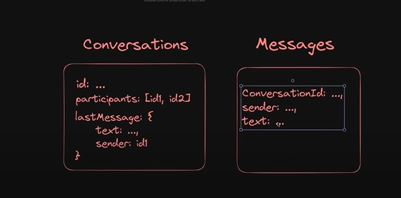

# Backend steps

- First change the directory into `backend` folder
- Generate `package.json`

`npm init -y`

- Install necessary dependencies

`npm i express jsonwebtoken bcryptjs dotenv mongoose cookie-parser`

- Create `server.js` file

- Generally we use `const express = require('express')` to import any module. But to use `ES6 Import and Export`, inside `package.json` we need to add `"type":"module",` and then use `import express from 'express'`. If we donot add `"type":"module",` we will get `SyntaxError: Cannot use import statement outside a module`

- Configure `.env` by importing `import dotenv from "dotenv"` and then use it using `dotenv.config()`. Now we can define variables in `.env` file and use them in our application using `process.env.VARIABLE_NAME`

- `Database Setup`: In this appilcation we are using `MongoDB` as Database. So created a folder in backend folder as `db` and then created a javascript file `connectDB.js` where we will write our code to connect DB

- `DB Models Creation`: created a seperate folder for all the models.

- `MIDDLEWARE`: Middleware is the function that runs between request and response

# Models for Conversations and messages

