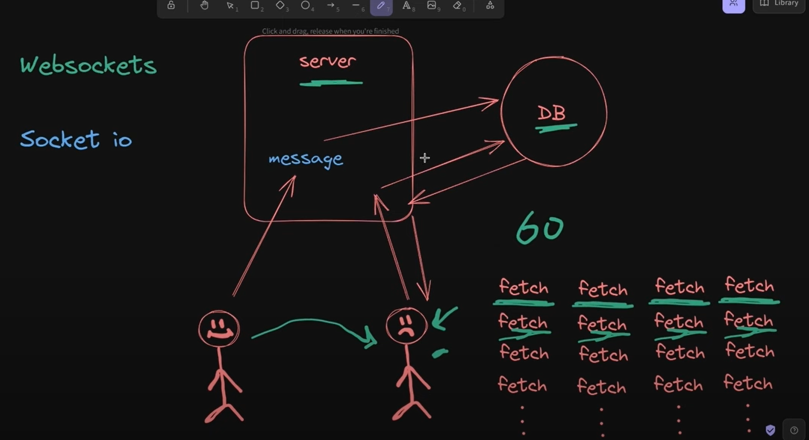
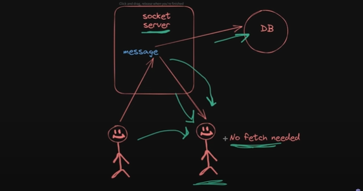
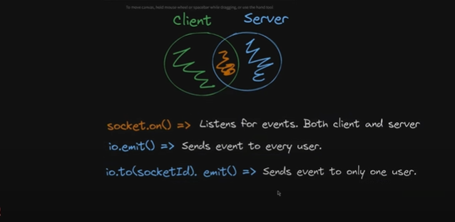
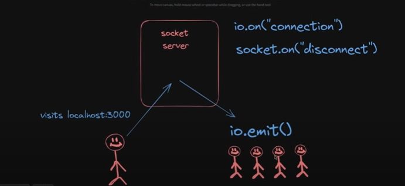
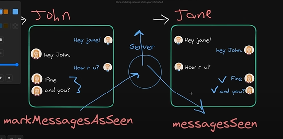

# To-do

- Make custom hook for `handleDeletePost`.
- `cursor:"pointer"` where ever necessary.
- Add Actions to the comments.
- Remove `showToast` from `useEffect dependencies` if not necessary
- Add delete comment functionality.
- Implement `Debouncing`
- Add Avatar in header to show img of user instead of icon.

# To get rid of cors error

- We can add

  `server: {
  // to get rid of cors error
  proxy: {
    "/api": {
      target: "http://localhost:3000",
      changeOrigin: true,
      secure: false,
    },
  },
},`

  in `vite.config.js` file

# Achieving Chat functionality without webSocket

# Achieving Chat functionality with webSocket

# Websocket Implementation

- After socket setup in the backend install `socket-clent` in the frontend

`npm i socket.io-client`

# seen unseen functionality

